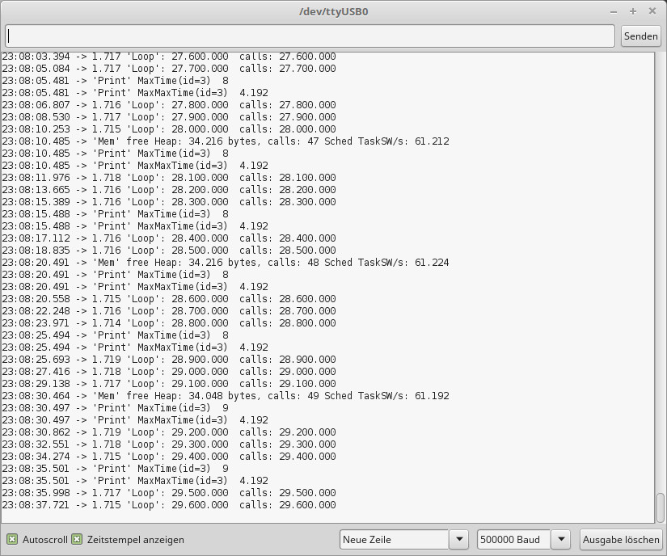

<h1 align="center" color="blue">ESP8266Scheduler2</h1>

========================================================================

    inspired by: 
    https://github.com/nrwiersma/ESP8266Scheduler
    
    
  (C) 2019 Helmut Weber
  
  You can find ***EP8266Scheduler*** in the official Arduino Esp8266 Libraries
  It is a very elegant and compact tool to add cooparative multi-
  tasking to your ESP8266 (based on cont.h)
  
  The Idea:
  
  Get a ready and tested sketch, and make a task out of it.
  Just write

      class MyFirstTask : public Task {
          YOUR SKETCH
      } myfirst_task;
  
  That's it!
  
  The task can have setup() - just called once - and a loop() which is
  called from time to time
  
  The task may have  **delay(ms)**   which is done nonblocking.
  
  Down in the program there is the program-setup, where you start the
  class-Tasks and then call
  **Scheduler.begin()** to start the system of multitasking.
  A  loop()  must be there for the linker, but it is never called.
  
  ***A brilliant concept!***
  
  But of cause I have some criticism ;)
  
  - The instances of the classes are put in a linked list
    That makes it impossible to influence the tasks from the outside.
    
  - The tasks do not have states. Every tasks decides (using shouldRun())
    if it is in  delay()  or not.

  - The Scheduler needs a context  'main'  which is useless, because
    there is no other activity in the program than the Scheduler
    
  
diff
+<h2 align="center">My Changes</h2>
  
  - Task-Pointers are saved in an array instead of a linked list

  - cont.h is part of the source, not of library
    Then you can use a stackspace of for instance 1024 bytes instead of
    4096 bytes - a tremendous saving!

  - Tasks do have a state READY, DELAYED, BLOCKED
    So Tasks may block itself or other tasks and other tasks (or Interrupts)
    may resume tasks.
    And now you can implement all the states like 'WAITIRQ', 'WAITSIGNAL' ...
    like in CoopOS ;)

  - The Scheduler dos not call the tasks in a round robin way, but allways
    looks in the array of tasks beginning with the first in the list
    to see if it is ready to start.
    This gives a priority of tasks!
    The last task in the list is only called, of no oter task is READY.
    This influences the timing of tasks dramatically!
    The first task in the list is the most deterministic, the last one
    may get a big jitter.

  - delayMicroseconds() are addes.
  
  - because ther is no loop in the main program you have to call the
    yield()  of the system (WebServer!)
    I do NOT call this yield after evers task switch but include a timing
    to call this yield 5 times a second.
    To distinguish it from the task-yield, which gives controll back to
    the Scheduler, I name the tasks yield   Yield();
    Introducing a bool 'critical' can prevent the Scheduler to call the
    system 'yield()'.
    There may are some delays or in your sketch where you do not accept the
    4ms addon of the WebServer

    The results of this demo are not so bad:
    - Six tasks running including a WebServer
    - >60.000 taskswitches AND executions per second
    - Max time from tasks to task: mostly some microseconds, up to 1ms
    - with WebServer: 4 ms
    - free heap: >34.000 bytes
    - program space 27%
    - dynamic memory space 53%
    - Lowest priority tasks (`Loop') called 100.000 ties in 1,7 seconds
    

    No interrupts used, but may be included (timer and external)

    
    ## CONCLUSION:
    
    This is a simple method to combine existing tasks as 'snippets' into
    a multitasking system.
    
    ========================================================================

    For me, my CoopOS-Version (which uses cont.h as well) is much more versatile: 
    
    ## CoopOS with Stack-Change for ESP8266
    
    https://github.com/MacLeod-D/ESP8266-Multitasking-CoopOS
    
    ========================================================================
    
    ### Installation
    Just unzip **ESP8266_Scheduler2.zip** into your Arduino sketchfolder
    
    
